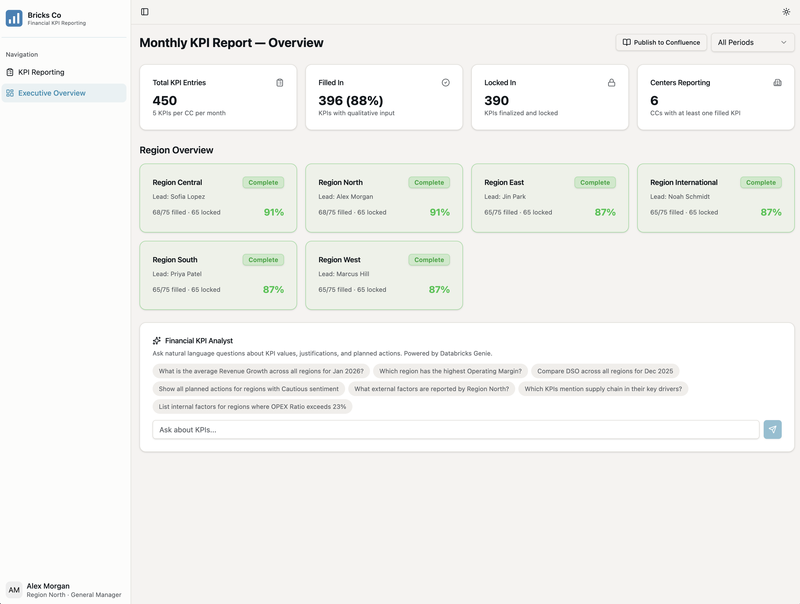
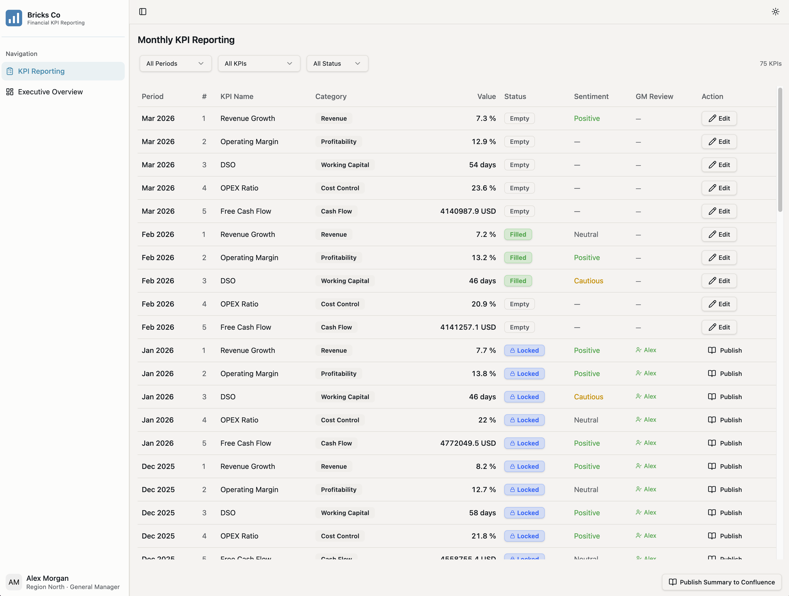

# Financial KPI Reporting

A reference Databricks App for **governed monthly financial KPI reporting** across multiple business units or regions. Demonstrates an end-to-end pattern combining **Databricks Apps + Lakebase + Unity Catalog + Genie + (optionally) Confluence publishing** for a multi-unit enterprise.

> Built as a Field Engineering reference implementation. Synthetic data only — clone and customize for your own organization.

## What it does

Two personas, one app:

| Persona | What they do |
|---|---|
| **Regional Lead** (e.g. *Alex Morgan*) | Submits monthly KPI actuals + qualitative justifications, locks them once reviewed |
| **CFO** (e.g. *Sam Carter*) | Views consolidated dashboard, drills into underperforming regions, asks ad-hoc questions through embedded Genie, *(optionally)* publishes the executive summary to Confluence |

Out of the box the demo seeds 6 regions × 5 KPIs (Revenue Growth, Operating Margin, DSO, OPEX Ratio, Free Cash Flow) across 13 historical months and 2 in-progress months.

The Confluence publish-to-wiki feature is **off by default** — the app works without it. Flip the `enable_confluence` widget in notebook 03 to turn it on.

## Screenshots

**Executive Overview** — consolidated KPI dashboard: completion / lock summary cards, per-region status, and the embedded *Financial KPI Analyst* (Databricks Genie) for natural-language Q&A.



**KPI Reporting** — regional leads enter, justify, and lock monthly KPI actuals; locked rows are published to Confluence.



## Architecture

```
┌──────────────────────────────────────────────────────────────┐
│  React (TanStack Router) frontend — submission + dashboard   │
└──────────────────────────────┬───────────────────────────────┘
                               │ REST
┌──────────────────────────────┴───────────────────────────────┐
│  FastAPI backend (Databricks App)                            │
└─────────┬──────────────────┬──────────────────┬──────────────┘
          │                  │                  │
┌─────────┴──────┐  ┌────────┴────────┐  ┌──────┴───────┐
│ Lakebase       │  │ Genie Space     │  │ Confluence   │
│ (Postgres)     │  │ (NL → SQL)      │  │ REST API     │
└────────┬───────┘  └─────────────────┘  └──────────────┘
         │ Lakebase CDF (CDC)
┌────────┴───────┐
│ Unity Catalog  │
│ Delta tables   │
└────────────────┘
```

| Component | Tech | Purpose |
|---|---|---|
| Frontend | React 19, TanStack Router, Recharts, Tailwind | Submission UI + executive dashboard |
| Backend | FastAPI, Pydantic, SQLAlchemy + psycopg | API + Lakebase / Genie / Confluence integration |
| Transactional store | Databricks Lakebase Autoscale (PostgreSQL) | KPI submissions, departments, userbase |
| Analytical store | Unity Catalog Delta tables | Genie-readable view of submissions, kept fresh by Lakebase CDF (Change Data Feed, formerly "Lakehouse Sync") |
| Governed metrics | Unity Catalog metric view (`kpi_metrics`) | One governed KPI definition (Lock Rate, Avg Achievement, …) shared by Genie, AI/BI dashboards, and the app |
| AI | Databricks Genie | Natural-language Q&A over the KPI data + governed metric view |
| Publishing | Confluence Cloud REST API | Idempotent page publishing per submission and per dashboard summary |
| Reminders | Databricks SQL Alert / Job | Daily nudge for unjustified KPIs |
| Build/Deploy | APX (FastAPI + React scaffolder), Databricks Asset Bundles | One-command bundle deploy |

## Prerequisites

**Databricks workspace** must have:
- **Apps**, **Lakebase**, and **Genie Spaces** enabled
- Your account: permission to create Unity Catalog schemas and Lakebase projects, and to create Apps + attach resources

**Optional** (only if you want the publish-to-Confluence feature):
- A Confluence Cloud space and an Atlassian account that can mint API tokens

**On your laptop** (just for the initial `databricks bundle deploy`, and for local dev):
- [Databricks CLI](https://docs.databricks.com/dev-tools/cli/index.html) authenticated to your workspace (`databricks auth login`)
- Python 3.11+, [uv](https://docs.astral.sh/uv/)
- Node 20+, [Bun](https://bun.sh/) (only needed because `apx build` uses Bun for the React build)

## Deploy on Databricks

The install is two CLI commands plus a couple of UI clicks for things that don't have a public API yet:

```bash
# 1. From the repo root: build + push code, notebooks, and the wheel.
#    This creates /Workspace/Users/<you>/financial-kpi-reporting/dev/...
databricks bundle deploy
```

Then in the workspace, open **`notebooks/01_setup_lakebase.py`** — under `/Workspace/Users/<you>/financial-kpi-reporting/dev/files/notebooks/`, a normal visible folder in your workspace home. That notebook is the canonical deploy walkthrough. It's a guided checklist that runs Lakebase setup itself and points you at notebooks 02 and 03 for the rest:

| Step | What | Where |
|---|---|---|
| 1 | Lakebase project + tables + seed | runs in notebook 01 |
| 2 | Lakebase CDF activation (CDC → Delta) | notebook 02 + UI activation |
| 3 | Genie Space, Confluence token (optional), App + resources, Apps deploy | notebook 03 (SDK + UI) |

A troubleshooting matrix sits at the bottom of notebook 03 for the most common failure modes.

> **Prefer a Git folder?** If running notebooks out of the bundle's deploy folder feels unnatural, you can instead clone this repo as a [Databricks Git folder](https://docs.databricks.com/repos/index.html) (**Workspace → Create → Git folder**) and run **notebooks 01 and 02** directly from there — they only need a configured workspace, not the built app. **But notebook 03's App-deploy step still requires `databricks bundle deploy`**: it deploys the App from the built `.build/` artifacts (wheel + bundled frontend), and `.build/` is a build output that is *not* committed to git (it's `.gitignore`d), so a Git-folder clone has it empty. In short: a Git folder is fine for reading/running the setup notebooks, but the `databricks bundle deploy` above is still the supported way to get the App's code into the workspace.

> **Operational note**: every time you run `databricks bundle deploy` from your laptop (e.g. after a code change), it overwrites the workspace `.build/app.yml` with your bare local one. After a bundle deploy you must re-run **Step 4** of notebook 03 — that cell regenerates `app.yml` from your widget values and redeploys the App.

## Local development

The app falls back to an in-memory mock when Lakebase isn't reachable, so you can run the full UI locally without any Databricks resources.

```bash
# Install Python deps
uv sync

# Install JS deps
bun install

# Copy the env template and fill in if you want to talk to a real Lakebase /
# Genie / Confluence; leave blank for the in-memory mock
cp .env.example .env

# Run dev server (FastAPI + Vite, hot reload)
uv run apx dev
```

Open [http://localhost:8000](http://localhost:8000). The mock layer (`src/kpi_reporting/backend/mock_data.py`) has the same shape as the Lakebase seed, so the UI behaves the same.

To force the mock even when Lakebase env vars are set:

```bash
KPI_REPORTING_FORCE_MOCK=true uv run apx dev
```

## Customizing for your organization

This is a reference implementation. Most adopters change at least:

- **Departments / regions** — `DEPARTMENTS` in `notebooks/01_setup_lakebase.py` and `mock_data.py`
- **KPI definitions** — `KPI_DEFINITIONS` in the same files. The schema accepts arbitrary KPI names per region; the UI is generic
- **Userbase** — replace the synthetic emails with your workspace identities so SSO flows through to the right region
- **Publishing target** — the Confluence client (`backend/confluence.py`) is a small, replaceable adapter. Swap it for SharePoint, email, or any docs system
- **Access control** — today the backend trusts the userbase mapping for role assignment. For production, implement row-level security:
  - Option A: SQL RLS in Lakebase queries (filter `kpi_submissions` by `department_id` matching the user's region)
  - Option B: Unity Catalog fine-grained access control (UC FGA) on `departments` and `kpi_submissions` tables
  - See [SECURITY.md](SECURITY.md) for details

## Tearing down

When you're done with the demo:

```bash
databricks bundle destroy
```

…removes the bundle workspace files. To remove the Lakebase project, the App, the synced UC schema, and the secret scope, run **`notebooks/99_teardown.py`** (set the `confirm` widget to `yes`). The Genie Space has to be deleted via the workspace UI — there's no public API for that yet.

## Repo layout

```
financial-kpi-reporting/
├── README.md, DESIGN.md
├── pyproject.toml, package.json   # uv + bun configs
├── app.yml                         # Databricks Apps runtime config
├── databricks.yml                  # Asset Bundle definition
├── notebooks/
│   ├── 01_setup_lakebase.py        # Lakebase tables + seed data + canonical deploy guide
│   ├── 02_setup_forward_etl.py     # Lakebase CDF (CDC to Delta) + clean views for Genie
│   ├── 03_deploy_app.py            # Genie Space + Confluence + App + grants + Apps deploy
│   └── 99_teardown.py              # Reverses notebooks 01–03 (delete app, project, schema, scope)
└── src/kpi_reporting/
    ├── backend/                    # FastAPI app, Lakebase/Genie/Confluence clients, mock layer
    └── ui/                         # React frontend (TanStack Router, Recharts, Tailwind)
```

## Open-source dependencies

All third-party dependencies — grouped by license, with versions, project URLs, and copyrights — are listed in **[NOTICE.md](NOTICE.md)** (reviewed and approved by Databricks Legal). They are permissively licensed (MIT / BSD-3-Clause / Apache-2.0) except the PostgreSQL driver **psycopg** (LGPL-3.0), which is used unmodified and dynamically linked at runtime (imported via SQLAlchemy). Build-time tooling and the internal APX scaffolder are not distributed and are not attributed. Full version specs: `pyproject.toml` (Python) and `package.json` (Node.js).

## Environments & proxies

This repo pins **public registries** (PyPI for Python, the public npm registry for the frontend) and installs from the committed lockfile — so it behaves the same whether you have no proxy, a corporate mirror, or a different one. Routing to a mirror is a **local** concern; nothing internal is committed.

- **Install (index-agnostic):** `uv sync --frozen` installs the exact pinned versions from `uv.lock` using their public `files.pythonhosted.org` URLs + hashes. It does **not** re-resolve, so your index configuration is irrelevant — this is the reliable path on any network that can reach the public CDN.
- **Behind a private mirror?** Point uv / npm at it **locally** (never commit it):
  ```bash
  export UV_DEFAULT_INDEX=https://<your-mirror>/simple    # Python (uv)
  echo 'registry=https://<your-mirror>/' > .npmrc          # frontend (.npmrc is gitignored)
  ```
- **Re-locking** (`uv lock`) and a **clean `databricks bundle deploy` build** must *resolve* packages (Python build backend + npm), so run those from an environment with public PyPI / npm egress (or a fully-mirroring proxy) — not a network that can only reach a partial internal proxy.

## Maintainers

Maintained by **Databricks Field Engineering**. Code ownership is enforced via [CODEOWNERS](.github/CODEOWNERS).

- **Issues / PRs:** open in this repo
- **Security disclosures:** see [SECURITY.md](SECURITY.md) — email `security@databricks.com`, do not open a public issue

## License

See [LICENSE.md](LICENSE.md) and [NOTICE.md](NOTICE.md).
